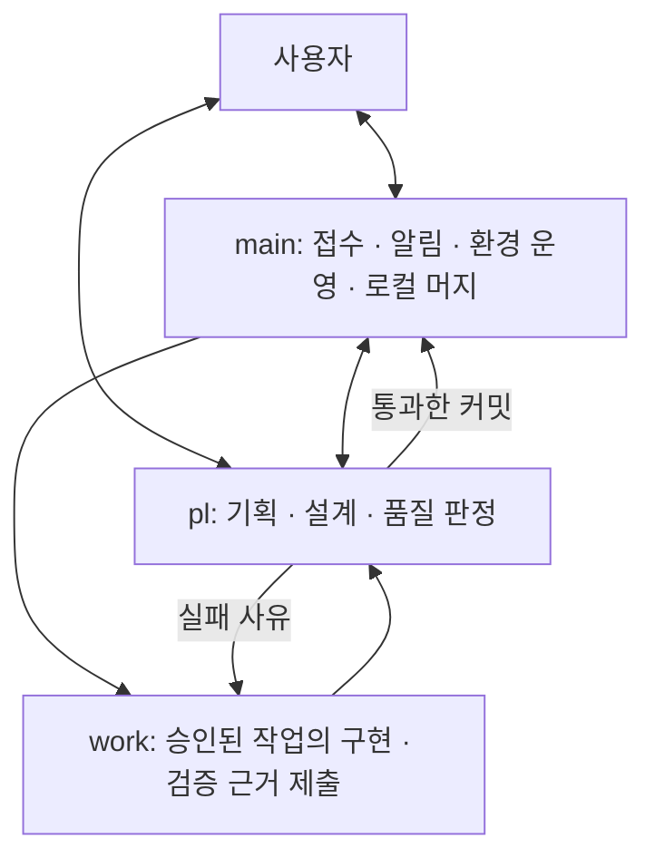

# ohmyPM 1.0

로컬 프로젝트를 돌보는 PM 에이전트와, 요청을 설계·구현·검증까지 이어 주는 작업 구조입니다.

1.0은 기존 작업 흐름을 **main · pl · work**로 재구성합니다. 작은 수정은 main이 직접 처리하고,
설계가 필요한 일은 사용자와 pl이 완료 기준을 합의한 뒤 작업별 환경에서 구현합니다.
기존 프로젝트 점검·대시보드·보고 기능도 유지합니다.

## 역할과 흐름



- **main**은 요청을 분류하고 환경을 준비합니다. 작은 가역 수정은 직접 끝냅니다.
- **pl**은 사용자와 필요한 만큼 논의하고 완료 기준·검증 방법·도구를 정합니다. 코드와 실제 동작도 확인합니다.
- **work**는 승인된 범위를 독립 워크트리·브랜치·세션에서 구현합니다. 의존성·설정·포트·데이터를 작업에 맞게 준비합니다.

사용자가 특정 설계 버전의 구현을 요청하면 시작합니다. 독립성이 확인된 작업만 최대 두 개 병렬로 실행하고,
검증과 pl 판정을 통과한 커밋을 main이 순차로 로컬 머지합니다. 판정 뒤 코드나 main이 바뀌면 다시 검증합니다.
실패한 작업·사용자 변경은 보존하고, 반영과 결과 보존이 확인된 환경만 회수합니다.

## 설치·이전

작업 구조에는 Python 3.11+, Git, 실행 중인 Orca, 역할별 에이전트 CLI가 필요합니다.
Python 실행 도구에는 외부 패키지가 필요하지 않습니다. 설치된 모델 CLI의 로그인은 기존 설정을 사용합니다.

저장소의 `plugin/`은 Claude Code 플러그인입니다. 플러그인 설치와 기존 대시보드 실행은
[설정 가이드](docs/setup.md)를 참고하세요. 프로젝트에 작업 환경을 등록하려면(2.0, 프로젝트 파일 무변경):

```powershell
python plugin/skills/kickoff-workspaces/scripts/ws_upgrade.py <프로젝트경로> --dry-run
python plugin/skills/kickoff-workspaces/scripts/ws_upgrade.py <프로젝트경로>
```

실행기·절차·템플릿은 외부의 내용 해시 패키지에, 프로필·원문·승인·증거는 프로젝트의 `.git/ohmypm/`에 남습니다.
추적 파일·index·HEAD·훅·AGENTS.md·CLAUDE.md는 바뀌지 않으며 커밋할 것이 없습니다.
기존 1.0 설치본은 `migration-plan`으로 검토한 뒤 `migration-apply`로 정리합니다(별도 커밋, 자동 push 없음).

등록 후:

```powershell
python <runtime.path>\scripts\environment_cli.py --project <프로젝트경로> doctor
python <runtime.path>\scripts\environment_cli.py --project <프로젝트경로> role-connect --role main
```

명령·복구는 [runtime.md](plugin/skills/dispatch/references/runtime.md), 절차는 [PROTOCOL.md](plugin/skills/kickoff-workspaces/PROTOCOL.md)에 있습니다.
역할별 모델은 등록 시 `--profiles` JSON으로 정하고 진행 중 작업은 고정 runtime을 계속 씁니다.
작업 컨테이너는 개발 환경의 묶음이며 Docker나 OS 보안 격리를 요구하지 않습니다.

## 사용

main에게 평소처럼 요청합니다. 설계가 필요하면 main의 안내로 pl에서 논의하고, 정해진 설계 버전으로 구현을 요청합니다.
pl이 추가 결정을 요청하면 main이 질문과 pl 대화 위치를 안내합니다. 실행 중 상태와 근거는 로컬 파일에 남습니다.

```text
원문 → pl과 설계 합의 → 버전 승인 → work 준비·구현 → pl 검증 → main 로컬 머지 → 환경 회수
```

기존 PM 대시보드는 `http://127.0.0.1:8123`에서 사용합니다. 이번 버전은 작업 구조와의 화면 통합을 추가하지 않습니다.
원격 푸시·배포·다른 프로젝트 일괄 이전은 각각 요청된 범위에서 진행합니다.

## 검증과 적용 범위

```powershell
python -m unittest discover -s tests -v
```

실제 임시 Git 저장소와 Orca 대역으로 승인·환경 준비·품질 판정·머지·복구를 검증합니다.
단일 모델보다 결과가 좋아지는지는 별도 실측 대상입니다. 같은 요구사항·도구·비슷한 예산으로
누락·결함·사용자 수정 횟수·시간·비용을 비교하고, 사용자 판단 후 다른 프로젝트로 확대합니다.

- [1.0 설계와 확인 결과](docs/tasks/T-005-v1-workflow.md)
- [작업 절차](docs/protocol.md)
- [기존 PM 기획](docs/plan.md)
- [플러그인 변경 내역](plugin/CHANGELOG.md)
