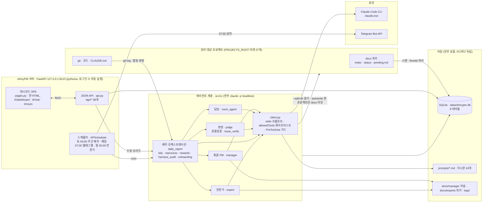
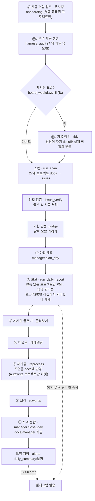
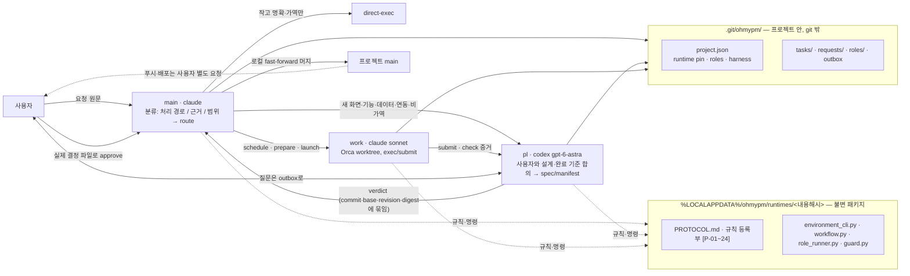

# ohmyPM 아키텍처 — 그림 한 장 (v2)

- **산출물 버전**: v2 (2026-09-23) · v1은 2026-09-17 설계 단계의 텍스트 한 장(git 이력 `a31ab99` 이전)
- **기준**: 서버 앱 `ohmypm 0.1.0` · 플러그인 `2.2.0` · 커밋 `a31ab99` · 단계 **구현**
- **버전 규칙**: 프로젝트가 버전업되면 이 문서도 같이 올린다(머리의 기준 세 값을 갱신하고 아래 이력에 한 줄). 구성이 안 바뀐 버전업이면 "변경 없음"으로 적는다
- 그림은 mermaid — GitHub·Obsidian에서 그대로 그림으로 보인다. 근거는 코드(`src/`, `plugin/`)와 실서버 `/openapi.json`이며, 추론이 섞인 곳은 `(inferred)`로 표시했다

## 1. 전체 구성 — 무엇이 무엇을 부르나

읽는 법: 왼쪽 프로젝트들은 **읽기 대상**이고, 쓰기는 `autowrite`를 켠 프로젝트의 `docs/`에만 간다(기본 전부 꺼짐). 서버는 화면·API·스케줄러 세 역할을 한 프로세스에서 하고, 판단은 전부 headless Claude가 한다 — 서버 코드는 판단하지 않는다(결정론 계층: 스캔·파싱·화이트리스트 대조·스케줄).

## 2. 주간 배치 — 매주 토요일 03:00 (`daily_report.run_nightly`)

- 활동 판정 창은 **168시간**(`activity_window_hours`) — 배치 주기와 묶여 있다. 좁으면 놓침이 생긴다
- 배치 어느 단계가 죽어도 뒤 단계로 예외가 번지지 않게 감쌌고, 중단은 텔레그램으로 알린다("배치 중단")
- 매일 08:00 스캔 잡은 2026-09-23에 껐다(`scan_enabled=False`) — 주간 배치가 자기 스캔을 돌므로 중복이었다. 화면의 '스캔'·'판정' 버튼은 남아 있다
- 지각 유예 30분(`MISFIRE_GRACE`) — 기본값 1초라 정각에 바쁘면 그 주 배치가 통째로 사라졌던 실측(09-23)

## 3. 작업 구조 — 요청에서 검증된 결과까지 (플러그인 2.2.0, main·pl·work)

- **프로젝트 트리에는 아무것도 설치하지 않는다** — 훅 본체는 런타임, 켤 목록은 `.git/ohmypm/`, 기동 때 `--settings`로 얹는다 (PROTOCOL [P-16])
- 모든 역할은 승인 프롬프트 없이(bypass) 뜨고, 안전은 `guard.py`(되돌리기 불가·외부 발신 Bash 차단, 목록 대조만)가 맡는다 [P-15]
- 역할 세션은 Orca 터미널에서 돌고 생명주기(pid·종료 코드)를 `role_runner`가 기록한다 — 셸 생존이나 시간 경과로 판단하지 않는다 [P-12]

## 4. 데이터 지도 — 무엇이 어디에 사나

| 무엇 | 어디 | 비고 |
|---|---|---|
| 관리 대상·이슈·대화·게시판·담당 프로필·포트·자율 로그·설정 | `data/ohmypm.db` 9 테이블: `projects` `issues` `messages` `posts` `comments` `agent_profiles` `ports` `autolog` `alerts`(key/value) | 스키마는 `src/db/client.py`, 열 추가는 멱등 ALTER |
| 에이전트 지시문 | `prompts/*.md` (42개) | 코드가 아니라 문서 — `cc/prompts.py`가 읽는다 |
| 총괄 PM 저널 · 전문가 위키 | `docs/manager/` · `docs/experts/` | 로컬 전용(gitignore) |
| 로그 | `logs/ohmypm_YYYY-MM-DD.log` · `logs/server_console.log` | 하루 한 파일 |
| 작업 구조 상태 (프로젝트별) | `<프로젝트>/.git/ohmypm/` | git이 못 보는 자리 — gitignore 불필요 |
| 실행기 패키지 | `%LOCALAPPDATA%\ohmypm\runtimes\<해시>` | 내용 해시로 불변, 진행 중 작업은 자기 pin 유지 |
| 벤치마크·보류·보드·로그 위키 | `docs/benchmark.md` `pending.md` `status.md` `log.md` `mistakes.md` | 로컬 전용(gitignore) |

## 5. 경계 — 바뀌지 않는 것

- **자율 = 화이트리스트**. 에이전트는 "안전한가"를 판단하지 않고 "목록에 있나"만 확인한다(결정론). 삭제·외부 발신·DB 마이그레이션·force push는 목록을 아무리 넓혀도 원천 제외
- **LLM은 판정 권한이 없다**. 판정(action)과 확정(authority)을 한 에이전트가 동시에 공급하지 않는다(confused-deputy 항체, 2026-08-23)
- **로컬 단독**. 인증·RBAC 없음, 루프백 바인딩. PC마다 독립 인스턴스 — 코드·규약은 git으로, DB·로그·위키 운영 파일은 공유하지 않는다
- **프로젝트 트리 무설치**(플러그인) · **규칙에는 이유가 따라다닌다**(PROTOCOL [P-nn], `tests/test_docs.py`가 지킨다)

## 6. 인터페이스

API 38개와 외부 서비스·키는 [interfaces.md](interfaces.md)에. 실서버와의 기계 대조는 `curl 127.0.0.1:8123/openapi.json`.

## 이력

| 버전 | 날짜 | 기준 | 변경 |
|---|---|---|---|
| v1 | 2026-09-17 | 설계 단계, pl 브랜치 f04ba52 | 스택표(케이스·가중합)·주 흐름·결정론/LLM 경계·자율 경계·보류 3건 — 텍스트 |
| v2 | 2026-09-23 | 앱 0.1.0 · 플러그인 2.2.0 · a31ab99 · 구현 단계 | 구현된 그대로를 그림 4장으로. 주간 배치(09-23 주간 전환)·작업 구조 2.2.0·데이터 지도 추가. v1의 보류 3건(케이스 1 벤치마크·4 heartbeat·9 lychee)은 그대로 열려 있다 |
