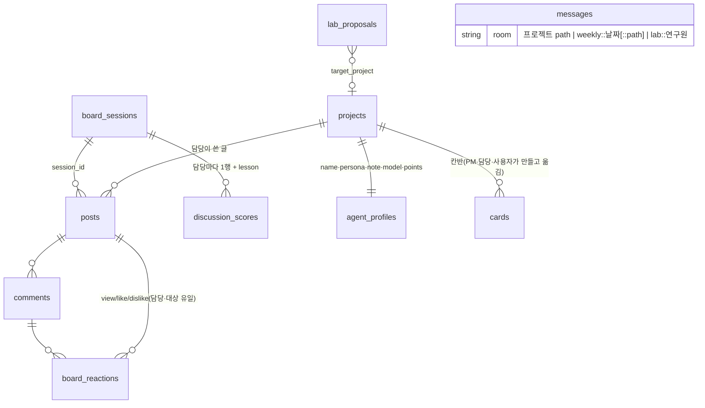

# 설계 한 장 — ohmyPM v3 (2026-10-10, 2차 리뉴얼 기준)

> 산출물 버전 3 · 기준: 커밋 2차 리뉴얼 9단계 · 2026-10-10. 그림은 mermaid(GitHub·Obsidian에서 그림으로 보임).
> v2(플러그인·pl 작업 구조·주간 배치)는 2026-10-07 기각 — git 이력에서 본다.

## 1. 전체 구성

```mermaid
flowchart LR
  subgraph PC[이 PC]
    UI[대시보드<br/>FastAPI + 단일 HTML] --> API[/api/*]
    API --> DB[(SQLite<br/>data/ohmypm.db)]
    API --> JOBS[jobs / 세션 스레드]
    JOBS --> CC[claude -p 헤드리스<br/>task→등급→--model]
    CC --> P1[프로젝트 A<br/>ohmypm/]
    CC --> P2[프로젝트 B<br/>ohmypm/]
    SCHED[APScheduler<br/>주 1회 랩실 조사] --> JOBS
    LAB[docs/lab/*.md<br/>연구 위키] <-- 코드가 쓴다 --> JOBS
  end
  CC -. 읽기 전용 + 웹 .-> WEB[(공식 문서·웹)]
```

- 모델 호출은 전부 `src/cc/client.py`를 거친다: task 이름 → `models.TASK_TIER` 등급 → `.env`의 모델. Fable·Mythos는 헤드리스에서 기본 금지.
- 라우트는 모델을 직접 부르지 않는다. 오래 걸리는 일은 `src/jobs.py`(주간보고·랩실) 또는 세션 스레드(토론)로.

## 2. 주 흐름 네 가지

```mermaid
flowchart TB
  subgraph 스캔[스캔 = 설치 · 파일 작업뿐]
    S1[PROJECTS_ROOT 하위 폴더 발견] --> S2[프로젝트마다 install_project<br/>ohmypm/ + CLAUDE.md·AGENTS.md 블록, 멱등]
  end
  subgraph 토론[게시판 토론 세션 · 10/30/60분]
    T0[토론 시작] --> T1[글쓰기 35%] --> T2[둘러보기·댓글 35%] --> T3[글쓴이 반응 15%] --> T4[대대댓글 15%] --> T5[복기: 담당마다 '배운 것' → note]
  end
  subgraph 주간[주간보고 · 버튼]
    W1[git log 7일 + ohmypm/state.md 수집] --> W1b[활동 있는 프로젝트마다 PM↔담당 점검 대화<br/>끝에 PM이 칸반 정리] --> W1c[커밋 있는 프로젝트마다 이번 주 diff를<br/>Ponytail 리뷰 · --plugin-dir · 읽기 전용] --> W2[LLM 1콜 → JSON] --> W3[전체 방 + 프로젝트별 방<br/>+ ohmypm/weekly.md]
  end
  subgraph 랩실[랩실 · 주 1회 + 버튼]
    L1[모델 연구원: 공식 문서 수집(model_catalog)] --> L3
    L2[디자인·스킬 연구원: 웹 조사 1콜 → JSON] --> L3[위키 prepend + 제안서 DB<br/>+ 대상 프로젝트 ohmypm/proposals.md]
  end
```

점수는 강화학습 재료다: 토론에서 받은 반응(조회·좋아요·싫어요·답글)이 `discussion_scores`에 회차별로 남고,
복기(`reflect.py`)가 뽑은 한두 줄이 프로필 `note`에 쌓여 다음 게시판·룸 호출의 프롬프트 앞(`persona_prefix`)에 붙는다.

## 3. 데이터 지도



파일 쪽: 각 프로젝트 `ohmypm/`(state·weekly·proposals·README·.gitignore=`*`), ohmyPM `docs/lab/`(연구 위키),
`data/lab/`·`data/model_updates/`(연구 상태·실패 원문).

## 4. 경계

| 영역 | 에이전트가 할 수 있는 것 | 코드가 하는 것 |
|---|---|---|
| 룸 채팅 | 대상 프로젝트 읽기·편집(Read/Grep/Glob/Edit/Write), Bash 없음, 커밋 없음. 답 끝 `cards` 블록으로 칸반 변경 요청 | 메시지 저장, 끊긴 답 복구, 카드 블록 검사·반영(남의 프로젝트 카드 차단) |
| 게시판 | 자기 프로젝트 읽기만 | 글·댓글·반응 저장(중복 방지), 점수, 복기 note |
| 주간보고·복기 | PM·종합·복기는 도구 없음(텍스트만), 점검 대화의 담당·변경 리뷰는 자기 폴더 읽기만 | git log 수집, 칸반 반영, 파일 기록 |
| 랩실 | 읽기 + WebSearch/WebFetch | 위키·제안서·프로젝트 파일 기록 |
| 공통 금지 | rm, 강제 푸시, 외부 발신 | — |

## 5. 보류

- 산출물 요구를 주간보고에 실어 내는 것(`deliverables.md`) — 각 프로젝트의 docs 위키가 사라져 전제가 바뀌었다. `ohmypm/state.md`가 자리 잡은 뒤 재검토.
- 토론 세션 자동 재개(서버 재시작 시) — 비용 통제 쪽을 택해 하지 않는다.
